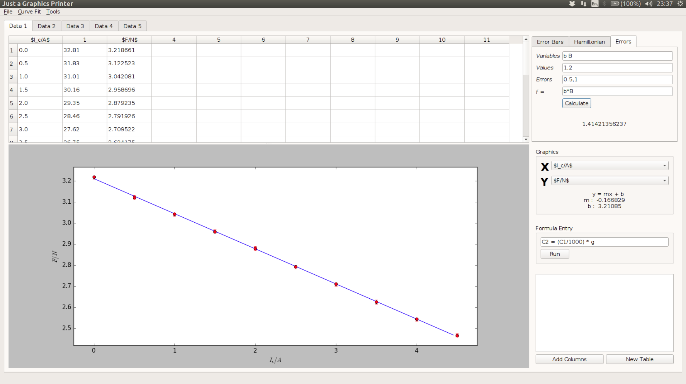
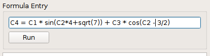
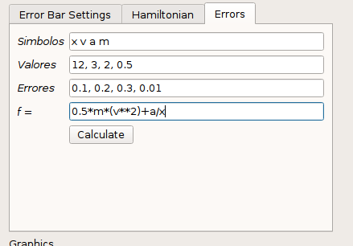
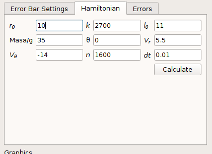

# Just a Graphics Printer (JGP)

  A simple technical graphing and data analysis program developed in order to facilitate operations in performing laboratory practice using python packages as numpy and matplotlib.pyplot.
  
  

## Index

1. [Requisites](#requisites)
2. [Installation](#installation)
3. [User's Guide](#UserGuide)
	* [Formula Entry](#formulaEntry)
	* [Errors Calculator](#errorsCalculator)
	* [Hamiltonian](#hamiltonian)
  
## <a name="requisites"></a> 1. Requisites
  
>* [Python 2.7](https://www.python.org/download/releases/2.7/) || 3.5 is not compatible.
>* [PyQt5](https://www.riverbankcomputing.com/software/pyqt/download5) || It provides the GUI interface

>* [Numpy](http://www.numpy.org/) 
>* [matplotlib](http://matplotlib.org/) 
>* [SciPy](https://www.scipy.org/install.html)

> You could download [Anaconda](https://www.continuum.io/downloads) for Python 2.7 which provides it. The version for Python 3.5 is not compatible and matplotlib.pyplot does not work

## <a name="installation"></a> 2. Installation

Once you have installed all the software listed under "Requisites" you can now begin the installation process:

####1. get the source

if you had installed git you could run this command on your shell terminal

``` shell
git clone https://github.com/Jaimedgp/J_Graphics_P.git
```

then you could add an alias on your .bashrc file running this command [Recommended]

``` shell
echo "alias JGP='python ./J_Graphics_P/MainWindow.py'" >> ~/.bashrc
```
  
if it is not, you should download the zip with all the repository and unzip it:

``` shell
cd

unzip J_Graphics_P-Development.zip
```

you could also add an alias on your .bashrc file running this command [Recommended]

``` shell
echo "alias JGP='python ./J_Graphics_P-Development/MainWindow.py'" >> ~/.bashrc
```

## <a name="UserGuide"></a> 3. User's guide

Working on it


### <a name="formulaEntry"></a> Formula Entry




### <a name="errorsCalculator"></a> Errors Calculator



### <a name="hamiltonian"></a> Hamiltonian


