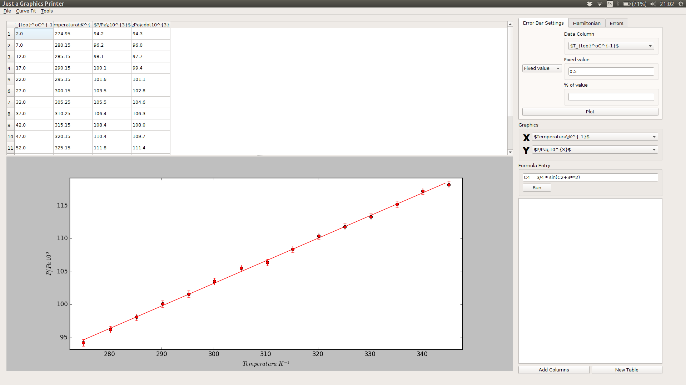

# Just a Graphics Printer (JGP)

_Just a Graphics Printer_ is a simple techincal graphing and data analysis program developed in parallel with the study of the physics degree, using differents python package as numpy, matplotlib or PyQt5. The aim of the project is to facilitate operantions and reports presnetation in performing laboratory practice done during the degree. By this way, the project has been grown as the laboratory practice become more complex and requires more sofisticaton, implementing differents functions.
  
  

## Index

1. [Requisites](#requisites)
2. [Installation](#installation)
3. [User's Guide](#UserGuide)
	* [Formula Entry](#formulaEntry)
	* [Errors Calculator](#errorsCalculator)
	* [Hamiltonian](#hamiltonian)
  
## <a name="requisites"></a> 1. Requisites
  
>* [Python 2.7](https://www.python.org/download/releases/2.7/) || 3.5 is not compatible.
>* [PyQt5](https://www.riverbankcomputing.com/software/pyqt/download5) || It provides the GUI interface

>* [Numpy](http://www.numpy.org/) 
>* [matplotlib](http://matplotlib.org/) 
>* [SciPy](https://www.scipy.org/install.html)

> You could download [Anaconda](https://www.continuum.io/downloads) for Python 2.7 which provides it. The version for Python 3.5 is not compatible and matplotlib.pyplot does not work

## <a name="installation"></a> 2. Installation

Once you have installed all the software listed under "Requisites" you can now begin the installation process:

#### 1. get the source

if you had installed git you could run this command on your shell terminal

``` shell
git clone https://github.com/Jaimedgp/J_Graphics_P.git
```

if you had not installed git (and you do no t want to install it ;-)) you could install it downloading the zip in this webpage an unzip it (it is recommended to save it in the main directory ~/).


``` shell
cd 
wget https://github.com/Jaimedgp/J_Graphics_P/archive/master.zip
unzip master.zip
```
Either you use git or the zip file to install the program, you should have a folder called J_Graphics_P (or J_Graphics_Printer-master if you used the zip file) in the main directory. In order to run the program, the MainWindow.py file must be run by the following command.

``` shell
python ~/J_Graphics_P/src/MainWindow.py #~/J_Graphics_P-master/src/MainWindow.py for the zip file
```

then you could add an alias on your .bashrc file running this command [Recommended]

``` shell
echo "alias JGP='python ~/J_Graphics_P/src/MainWindow.py'" >> ~/.bashrc
```
  
