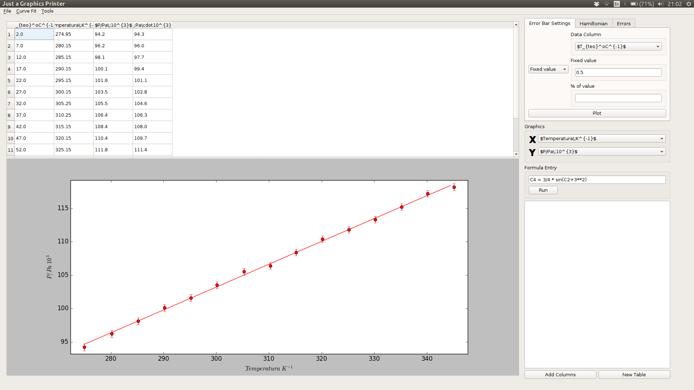

# Just a Graphics Printer (JGP)

  Just a Graphics Printer es un pequeño proyecto personal desarrollado de manera paralela con los estudios del grado en Física utilizando diferentes paquetes de python como numpy, matplotlib o PyQt5. Su finalidad es facilitar todo el procesamiento de datos, así como su presentación en los informes, de las diversas prácticas de laboratorio que se realizan en el grado. De esta manera, a medida que las prácticas iban requiriendo mayor sofisticación, he ido incorporando diversas funciones al programa en función de lo que se me exigía.
  
  

## Índice

1. [Requisitos](#requisites)
2. [Instalación](#installation)
3. [Guía de usuario](#UserGuide)
	* [Formula Entry](#formulaEntry)
	* [Errors Calculator](#errorsCalculator)
	* [Hamiltonian](#hamiltonian)
  
## <a name="requisites"></a> 1. Requisitos
  
>* [Python 2.7](https://www.python.org/download/releases/2.7/) || 3.5 no es compatible.
>* [PyQt5](https://www.riverbankcomputing.com/software/pyqt/download5) || Esto proporciona la interfaz GUI

>* [Numpy](http://www.numpy.org/) 
>* [matplotlib](http://matplotlib.org/) 
>* [SciPy](https://www.scipy.org/install.html)

> También se puede descargar el paquete [Anaconda](https://www.continuum.io/downloads) para Python 2.7 el cuál te proveé de dichos paquetes. La versión para Python 3.5 no es compatible y da ciertos errores.

## <a name="installation"></a> 2. Instalación

Una vez que ya has descargado todos los paquetes que se muestran en "Requisitos" puedes comenzar con el proceso de instalación:

#### 1. Obtener el código del programa

Si ya tienes instalado git en tu ordenador podrás obtener el programa corriendo el siguiente comando en tú terminal

``` shell
cd

git clone https://github.com/Jaimedgp/J_Graphics_P.git
```

Si en tú caso no tienes instalado git puedes descargarte el zip de ésta página web y descomprimirlo (se recomienda guardar el archivo en el directorio principal ~/). Si por el contrario prefieres utilizar la terminal puedes usar los siguientes comandos:

``` shell
cd

wget https://github.com/Jaimedgp/J_Graphics_P/archive/master.zip

unzip master.zip
```

En ambos casos obtendremos en nustro ordenador una carpeta llamada J_Graphics_P (J_Graphics_P-master en el caso del zip) en nuestro directorio principal. Para ejecutar el programa hay que compilar el script MainWindow.py mediante el siguiente comando: 

``` shell
python ~/J_Graphics_P/MainWindow.py
```

Recordar que si se ha descargado el programa mediante el archivo zip la carpeta J_Graphics_P se llama J_Graphics_P-master

## <a name="UserGuide"></a> 3. User's guide

Working on it

### <a name="PlotaGraph"></a> How to Plot a Graph


### <a name="formulaEntry"></a> Formula Entry


### <a name="errorsCalculator"></a> Errors Calculator


#### 

### <a name="hamiltonian"></a> Hamiltonian


